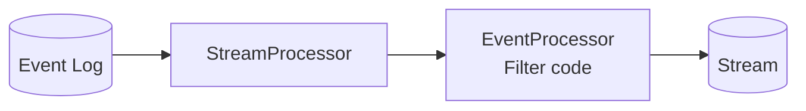
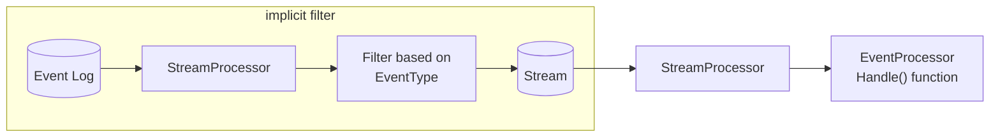
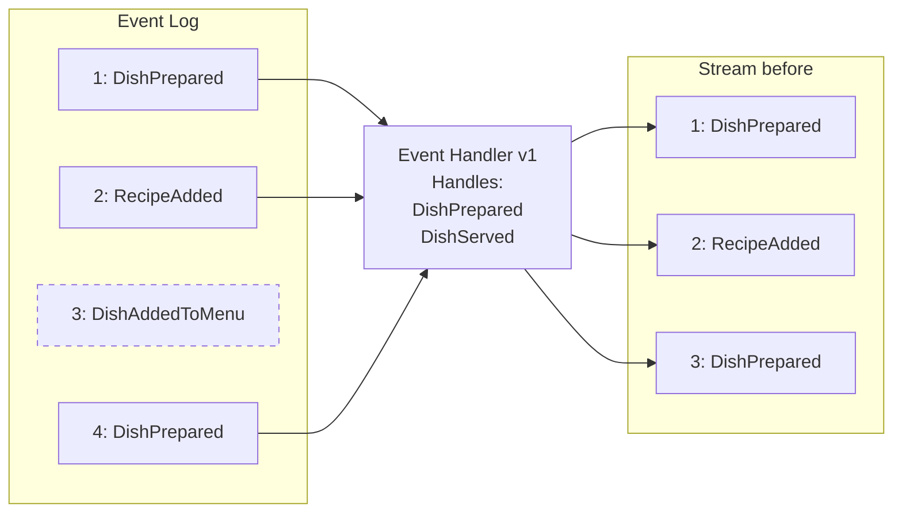
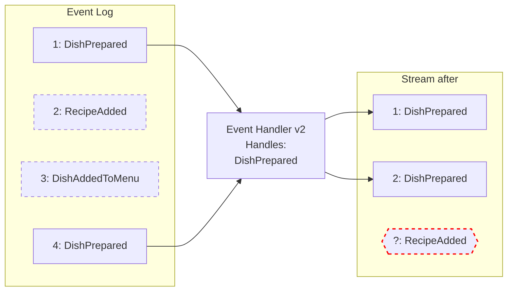
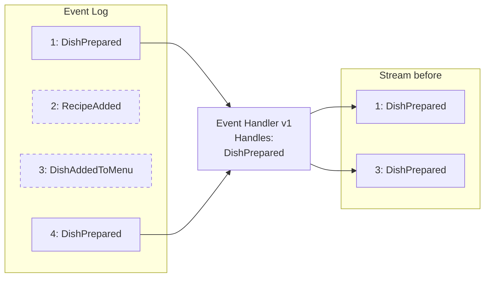
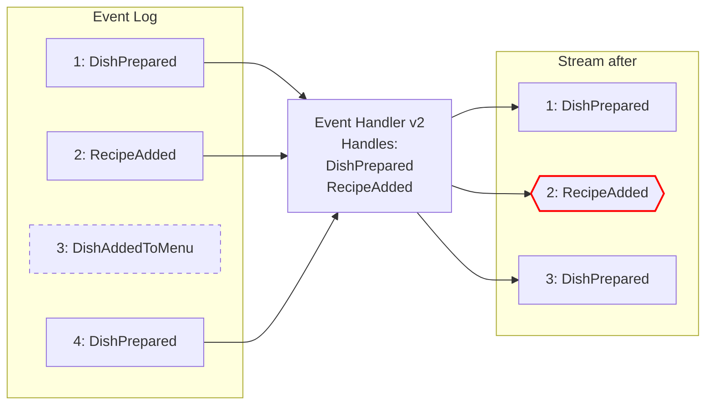

In event-sourced systems it is usually not enough to just say that an [Event]() occurred. You'd expect that something should happen as a result of that event occurring as well.

In the [Runtime]() we can register 2 different processors that can process events; [Event Handlers]() and [Filters]().
They take in a [Stream]() of events as an input and does something to each individual event.

Each of these processors is a combination of one or more [Stream Processors]() and [Event Processor]().
What it does to the event is dependent on what kind of processor it is. We'll talk more about different processors later in this section.

## Registration

In order to be able to deal with committed events, the heads needs to register their processors. The Runtime offers endpoints which initiates the registration of the different processors. Only registered processors will be ran. When the head disconnects from the Runtime all of the registered processors will be automatically unregistered and when it re-connects it will re-register them again. Processors that have been unregistered are idle in the Runtime until they are re-registered again.

## Scope

Each processor processes events within a single [scope](). If not specified, they process events from the default scope. Events coming over the [Event Horizon]() are saved to a scope defined by the event horizon [Subscription]().

## Filters

The filter is a processor that creates a new stream of events from the [event log](). It is identified by a `FilterId` and it can create either a partitioned or unpartitioned stream. The processing in the filter itself is however not partitioned since it can only operate on the event log stream which is an unpartitioned stream.

The filter is a powerful tool because it can create an entirely customized stream of events. It is up to the developer on how to filter the events, during filtering both the content and the metadata of the event is available for the filter to consider. If the filter creates a partitioned stream it also needs to include which partition the event belongs to.

However with great power comes great responsibility. The filters cannot be changed in a way so that it breaks the [rules of streams](). If it does, the Runtime would notice it and return a failed registration response to the head that tried to register the filter.

### Public Filters

Since there are [two types of streams]() there are two kinds of filters; public and private. They function in the same way, except that private filters creates private streams and a public filter creates [public streams](). Only [public events]() can be filtered into a public stream.

## Event Handlers

The event handler is a combination of a filter and an event processor. It is identified by an `EventHandlerId` which will be both the id of both the filter and the event processor.

The event handler's filter is filtering events based on the [`EventType`]() that the event handler handles.

Event handlers can be either partitioned or unpartitioned. Partitioned event handlers uses, by default, the [`EventSourceId`]() of each event as the partition id. The filter follows the same rules [for streams]() as other filters.

## Changes to event handlers

As event handlers create a stream based on the types of events they handles, they have to uphold the [rules of streams](). Every time an event handler is registered the Runtime will check that these rules are upheld and that the event handlers definition wouldn't invalidate the already existing stream. Most common ways of breaking the rules are:

### Disallowed: Removing events from the stream
The event handler stops handling an event type that it has already handled. This would mean that events would have to be _removed_ from the stream, breaking the _append-only_ rule.

Given an event handler that handles DishPrepared and RecipeAdded events, and the following event log we would get the stream as follows:

The Event Handler creates an invalid stream by removing an already handled event type:

Since the RecipeAdded event-type has already been committed to the stream, the stream would have to be changed to remove the RecipeAdded event-type. This would break the _append-only_ rule, as the stream would have to be changed. **This change is invalid, and will be rejected by the Runtime**.

### Disallowed: Adding events in positions other than the end of the stream
The event handler starts handling a new event type that has already occurred in the event log. This would mean changing the _ordering_ of events in the streams and break the _append-only_ rule.

The Event Handler creates an invalid stream by adding a new event at a position before the end of the existing stream:

It is possible to add a new type of event into the handler if it doesn't invalidate the stream. For example, you can add a new event type to the handler if it hasn't ever been committed _before_ any of the other types of events into the [event log]().

### Replaying events

An event handler is meant to handle each events only once, however if you for some reason need to "replay" or "re-handle" all or some of the events for an event handler, you can use the [Dolittle CLI]() to initiate this while the microservice is running.

The replay does not allow you to change what event types the event handler handles. To do this, you need to change the event handlers `EventHandlerId`. This registers a completely new event handler with the Runtime, and a completely new stream is created. This way no old streams are invalidated.

If you want to have an event handler for read models which replays all of its events whenever it changes, try using [Projections]() instead, as they are designed to allow frequent changes.


As creating a new event handler will handle all of its events, it's _very important_ to take care of the handle methods' side effects. For example, if the handler sends out emails those emails would be re-sent.



The replay functionality was added in version 7.1.0 of the Runtime, so you'll need a version newer than that to replay Event Handler events.


## Multi-tenancy

When registering processors they are registered for every tenant in the Runtime, resulting in every tenant having their own copy of the [Stream Processor]().
