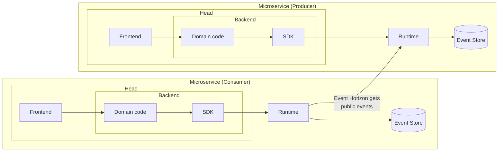
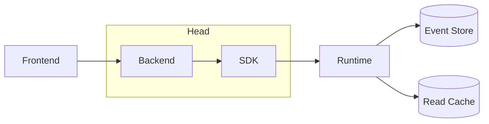
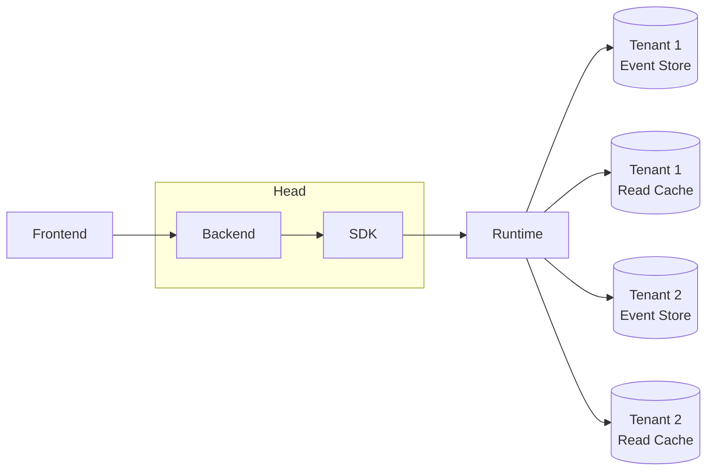

Dolittle is an event-driven microservices platform built to harness the power of events. It's a reliable ecosystem for microservices to thrive so that you can build complex applications with small, focused microservices that are loosely coupled, event driven and highly maintainable.

## Components
<!-- The Dolittle stack is composed of the SDKs, the Runtime, and the [Event Store](). -->

- [**Events**]() are _"facts that have happened"_ in your system and they form the _truth_ of the system.
- [**Event Handlers & Filter**]() and [**Projections**]() process events.
- The **Runtime** is the core of all Dolittle applications and manages connections from the SDKs and other Runtimes to its [Event Store](). The Runtime is packaged as a [Docker image](https://hub.docker.com/r/dolittle/runtime)
- The **SDK** is a client-library that handles communication with the **Runtime** for your code.
- The **Head** is the user code that uses the Dolittle SDK. This is where your business-code lives, or is called from. You create this as a docker-image where your code uses the **SDK**. It will usually contain your domain-code and a frontend.
- The [**Event Store**]() is the underlying database where the events are stored.
- A [**Microservice**]() is one or more Heads talking to a Runtime.
- Microservices can [produce]() public events and [consume]() such events that flow over the [**Event Horizon**]().

## Event-Driven
Dolittle uses an Event-Driven Architecture and supports [Event Sourcing](https://martinfowler.com/eaaDev/EventSourcing.html), which means to _"capture all changes to an applications state as a sequence of events"_, these events then form the _"truth"_ of the system. Events **cannot be changed or deleted** as they represent facts about things that have happened.

With event sourcing your applications state is no longer stored primarilly as a snapshot of your current state but rather as a whole history of all the state-changing events. These events can be replayed to recreate the state whenever needed.

For example: you can replay them in a test environment to see how a changed system would have behaved. By running through events up to a point in time the system can also reproduce the state it had at any point in time.

Event sourcing supports high scalability by being loose coupling. The events are the only thing that needs to be shared between different parts of the system, and separate parts can be made with different trade-offs for the scale they need to handle.

The history of events also forms a ready-made audit log to help with debugging and auditing.

## Microservice
A _microservice_, in our parlance, consists of one or many heads talking to one Runtime. Each microservice is autonomous and has its own resources and [event store]().

The core idea is that a microservice is an independently scalable unit of deployment that can be reused in other parts of the software however you like. You could compose as one application running inside a single process, or you could spread it across a cluster. It really is a deployment choice once the software is giving you this freedom.

This diagram shows the anatomy of a microservice with one head.


The _Read Cache_ in these pictures is not necessarily part of Dolittle. Different [projections]() call for different solutions depending on the sort of load and data to be stored.


### Multi-tenancy
Since compute is usually the most expensive resource, the Dolittle Runtime and SDK's has been built from the ground up with multi-tenancy in mind. Multi-tenancy means that a single instance of the software and its supporting infrastructure serves multiple customers, making optimal use of resources. Dolittle supports multi-tenancy by separating the event stores and resources for each tenant so that each tenant only has access to its own data.

This diagram shows a microservice with 2 tenants, each of them with their own resources.

## What Dolittle isn't
Dolittle is not a traditional backend library nor an event driven message bus like [Kafka](https://kafka.apache.org/). Dolittle uses [Event Sourcing](), which means that the state of the system is built from an append-only [Event Store]() that has all the events ever produced by the application.

Dolittle isn't a Command-Query Responsibility Segregation (CQRS) framework with formalized commands and queries, but [it used to be](https://github.com/dolittle/Bifrost). Dolittle allows you to write your own CQRS -abstractions on top of the SDK if you so desire.

## Technology
- [Runtime repository](https://github.com/dolittle/runtime)
- [C# SDK repository](https://github.com/dolittle/dotnet.sdk)
- [JavaScript SDK repository](https://github.com/dolittle/javascript.sdk)
- The connection between the runtime and the SDKs is managed through [gRPC](https://grpc.io/) calls, defined in our [Contracts repository](https://github.com/dolittle/contracts)

The Event Store is implemented with [MongoDB](https://www.mongodb.org/), and the resources -system give you access to a tenanted MongoDatabase for easy storage of your read-cache.

## What's next
- Read about [Events]()
- Ready to [Get Started]()?
