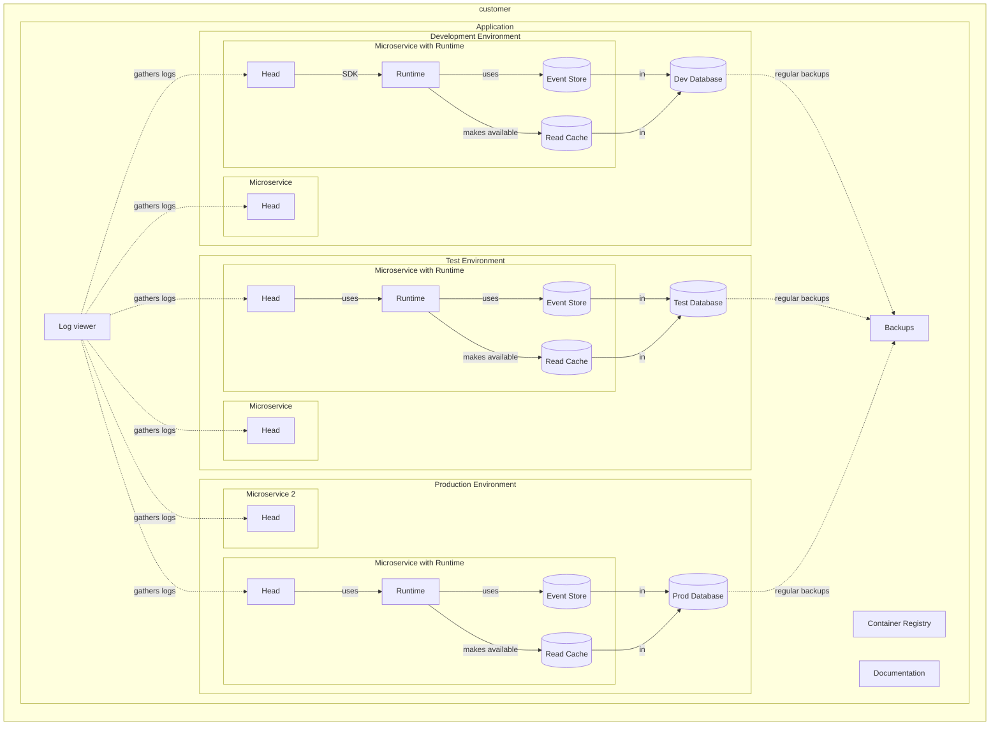

Aigonix Studio is your management-tool to interact with services and products you run in the Dolittle Platform. It is a web-based application that is available at [dolittle.studio](https://dolittle.studio).

In Studio you can create and manage Applications, Environments, Microservices and other products and services.

## Getting started

To access Studio you need to be a customer of Aigonix. If you are not a customer, you can [contact us](https://dolittle.com/contact) to learn more and hopefully become one.

Once you have access to Studio, you can log in using your credentials at [dolittle.studio](https://dolittle.studio). You can now create your first Application and start deploying your Microservices into that application.

## Components

When you run your Microservices in the Aigonix platform we will set up Applications with Environments wherein Microservices run. You will define each Application with its Environments, and add Microservices to them. You define which Docker image to use for each Microservice, and whether or not you want to use the Dolittle Runtime. If you use the Runtime one will be available from your Head and through it you will have access to Tenanted resources like the Event Store and Read Cache.

