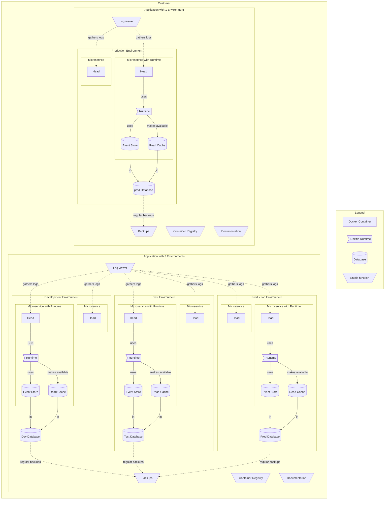

Aigonix Studio is your management-tool to interact with services and products you run in the Aigonix Platform. It is a web-based application that is available at [dolittle.studio](https://dolittle.studio).

In Studio you can create and manage [Applications](), [Environments]( ), [Microservices]() and other products and services.

## Getting started

To access Studio you need to be a customer of Aigonix. If you are not a customer, you can [contact us](https://dolittle.com/contact) to learn more and hopefully become one.

Once you have access to Studio, you can log in using your credentials at [dolittle.studio](https://dolittle.studio). You can now create your first Application and start deploying your Microservices into that application.

## Components

When you run your Microservices in the Aigonix Platform you will have access to a number of components that will help you manage your services.

You will define each Application with its Environments, and add Microservices to them. You define which Docker image to use for each Microservice, and whether or not you want to use the Dolittle Runtime. You can use a publically available image, or store your container image in the provided container-registry.

If you use the Dolittle Runtime one will be made available to your Head and through it you will have access to Tenanted resources like the Event Store and Read Cache. If you do not use the Dolittle Runtime the service will run the assigned Docker-image without permanent storage (stateless).

You can make your services available to the internet if you so wish. If you do not they will only be available within the platform.

