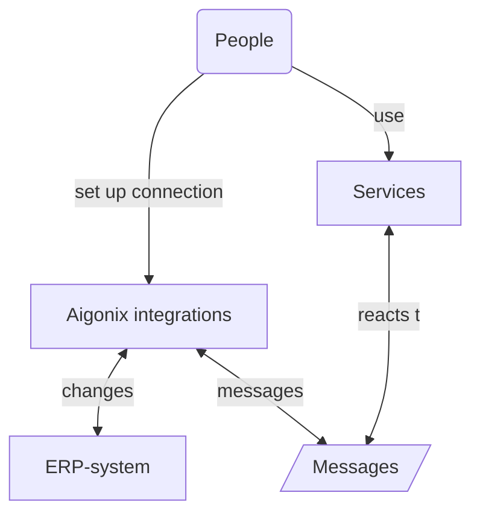
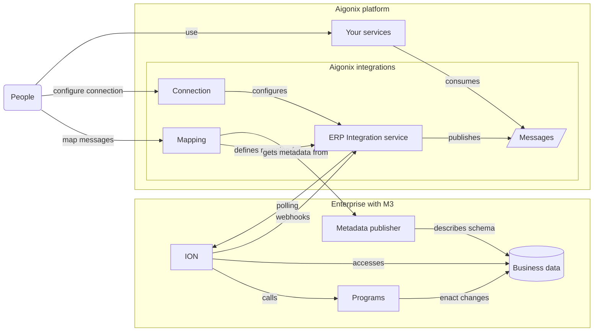

Integrations in Aigonix lets you work with your existing business-data in an ERP-system. The integrations support an [Event Driven Architecture]() and is designed to make translation from ERP-specific terms to domain terms easy.

By setting up integrations your business data from an ERP -system (Infor M3) can be synchronized to the Aigonix Platform. This data can then be used by your [Microservices]() to provide functionality to your users and customers.

## Conceptual overview

The integration with an ERP -system is built to support an Event Driven Architecture. By using it the business data in the ERP -system is translated to messages, which your services can consume and react to. Your services can also affect changes in the ERP -system by sending messages through the integration. This allows you to build services that can react to changes in the business data, and that can affect changes in the business data, without needing a direct connection to the ERP -system.

The Aigonix integrations acts as a bridge for your organization's valuable business data that exists in the ERP-system. Working directly with ERP-systems is often difficult, as they are locked down and frequently store the data in terms that are difficult to work with. The Aigonix integration is designed to make it easy to map the data in the ERP -system into messages with domain-names and terms that your services can understand. These messages are then securely available in standard message formats. For ease of use a REST -interface with resources in the domain-terms can be made available.

Central to this is the concept of a message-type-mapping (or just a "mapping"). A mapping defines how to translate data from the ERP -system into messages and vice versa. Mappings are defined in the Aigonix Studio -interface where you can select the data you want to translate and specify how to translate it. The mapping is then used to translate the changes in business-data into messages whenever such a change is detected.

In order to translate data from the ERP -system into messages a connection must be specified and a mapping must be defined. The connection specifies how to connect to the ERP -system and the mapping specifies how to translate the data into messages. Once you define the connection you can either run an instance of the ERP Integration service yourself (on-premises), or automatically host one in the Aigonix platform. This service is the conduit between the messages and the ERP -system. It is responsible for translating the messages into changes in the ERP -system and for translating changes in the ERP -system into messages.

The mappings themselves are defined in the Aigonix Studio -interface, and transferred to the ERP Integration service. They are defined in terms of the data in the ERP -system. The ERP integration service exposes webhooks that ION can use to notify of changes, or it can do regular polling to discover changes.

## Setting up a connection

Navigate to the "Integrations" in the Aigonix Studio -interface. Here you will see a list of all the connections that have been set up for your organization. If this is the first time you are setting up a connection the list will be empty.

Setting up a connection to an ERP -system -instance is done by clicking the "Set up M3 connection" -button. This will open a wizard that will guide you through the process of setting up the connection. The wizard will ask you for the following information:
- a name for the connection
- whether you want to self-host or use the hosted version of connection
- the URL and credential of the Metadata Publisher -service for your M3 -instance
- the ION-access -configuration for your M3 -instance

During the wizard the connection will come alive as it gets configured. This gives you immediate feedback on whether the connection is working or not.

### Step 0: Name and deploy the connection

The first step of the wizard is to give the connection a name and to choose whether you want to self-host the connection or use the hosted version. We recommend setting a name that describes the role of the ERP-system (e.g. is it the production system or a test system) and whether it is self-hosted or hosted.

{}

If you choose to self-host the connection you must download the connector bundle and run it on a machine that has access to the M3 -instance and the internet. The bundle contains a docker-image that will run the connector and a configuration file that tells the connector how to "call home".

{}

{}
If you choose to use the hosted version of the connection you must provide the URL and credentials for the Metadata Publisher -service for your M3 -instance. These endpoints must be available from the Aigonix cluster. This may require network-configuration, if your M3 -instance is firewalled.
{}

Once the connector has started and "called home" the wizard will display this information and you can proceed to the next step, configuring the metadata-publisher and ION-access.

### Step 1: Connect to the Metadata Publisher

The Metadata Publisher -service is a service that is part of the M3 -instance. It is used to publish metadata about the tables in the M3 -instance. This metadata tells the connector which tables exist in your M3 -instance, and which fields they contain.

The wizard will ask you for the URL and credentials for the Metadata Publisher -service. These must be available from the Aigonix cluster. This may require network-configuration, if your M3 -instance is firewalled.

Once the wizard has connected to the Metadata Publisher -service it will display the tables that are available in your M3 -instance.

{}
If you do not configure the Metadata Publisher -service you will not be able to map any custom tables or fields in your M3 -instance. This means that you will be restricted to mapping the "standard" tables and fields that are available in any M3 -instances.
{}

### Step 2: Connect to ION

The ION-access -configuration is used to connect to the ION -endpoint that is part of your M3 -instance. This is the communication channel that the connector uses to get data from and send messages to your M3 -instance.

Setting up ION-access is done in the Infor ION API management -interface. You need to create an "Authorized App" in this interface and then upload the generated credentials in the wizard.

When you upload the credentials they will be transmitted to the connector and it will verify that it can connect to the ION -endpoint. If the connection is successful the wizard will display the topics that are available in your M3 -instance.

{}

If you do not configure the ION -instance you will not be able to publish messages to your M3 -instance. This means that you will not be able to affect changes in your M3 -instance from Aigonix.

{}

The steps to create ION -credentials are as follows:
> 1. Open Infor ION API. Open the menu from the upper left corner and select 'Infor ION API'.
>
> 2. Select 'Authorized Apps' from the left hand menu followed by the '+' icon to add a new account.
>
> 3. Provide a name. Example: "Dolittle_Bridge".
>
> 4. Under 'Type', select 'Backend Service'.
>
> 5. Provide a description. Example: "Integration Connector".
>
> 6. Toggle on 'Use Bridge Authentication. Optional: You can toggle on ‘User Impersonation' if you would like to monitor specific user activity.
>
> 7. Click the save icon button.
>
> 8. Scroll down and click 'Download Credentials' button. If you would like to use an account you've previously created, you can access the account via 'Authorized Apps' then selecting the account name.
>
> 9. When the dialog pops up, toggle on 'Create Service Account' and provide a username from your M3 account you would like to associate with the ION service account.
>
> 10. Last, click 'Download'.

## Mapping tables

At this point you should have a connection to your M3 -instance, and you are ready to start mapping data from it to messages with the mapping interface. This interface is available by clicking on the "message types", next to "configuration".

### Step 0: Create a message-type

A message-type -mapping is a mapping between a table in your M3 -instance and a message-type in Aigonix. The mapping tells the connector which table to get data from, and how to transform that data into a message that can be consumed by your services. This is where you translate from the "language" of your M3 -instance to the "language" of your services.

You can map a table to many different messages, picking the relevant fields for each message.

Initially you will see an empty list of message-types, with a button to create your first one.

### Step 1: Name the message-type

Clicking on the button to create a new message-type will let you name and describe your new message, type. The name will be used to identify the message-type, and will be the basis for the messages you receive. For example: if you name your message-type "Item" you will receive messages with the type "ItemUpdated" and "ItemDeleted". When you use the REST API to it will interpret these messages and create a "Item" resource for you, with the fields you mapped.

## Consuming messages

***TODO: screenshots and description of the message consumption process***

## Publishing messages

***TODO: screenshots and description of the message publishing process***

## Exposing data

***TODO: screenshots and description of the ERP read-models***