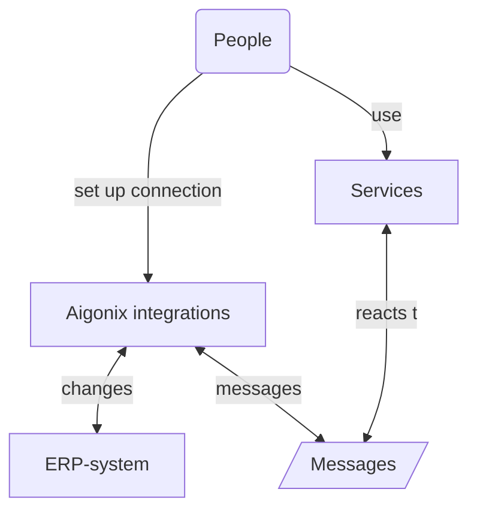
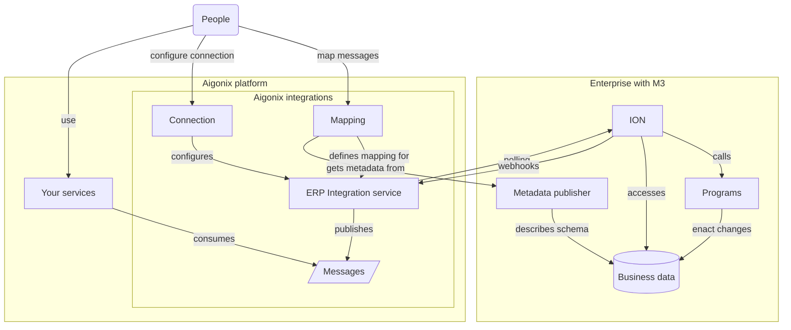

Integrations in Aigonix lets you work with your existing business-data in an ERP-system. The integrations support an [Event Driven Architecture]() and is designed to make translation from ERP-specific terms to domain terms easy.

By setting up integrations your business data from an ERP -system (Infor M3) synchronize to an message stream. This data can then be used by your [Microservices]() to provide functionality to your users and customers.

This article will introduce you to the concepts of the Aigonix integrations and show you how to set up a connection to an ERP -system and how to map data from the ERP -system into messages. It also describes how to consume these messages in your services.

## Conceptual overview

The Aigonix integrations acts as a bridge for your organization's valuable business data that exists in the ERP-system.

Aigonix integration connects to an ERP -system and is built to support an [Event Driven Architecture](). It translates the business-data in your ERP -system to messages, which your services can consume and react to.

Your services can also affect changes in the ERP -system by sending messages through the integration. You can now build services that can react to changes in the business data, and that can affect changes in the business data, without needing a direct connection to the ERP -system.

Working directly with ERP-systems is often difficult. They are locked down and frequently store the data in terms their own, obscure language. The Aigonix integration makes it easy to map business-data in the ERP -system into messages with domain terms that your services can understand. These messages are then securely available in standard message formats. For ease of use a REST -interface to resources representing the business-data in the domain-terms is available.

Central to this is the concept of a message-type. You define how to translate data from the ERP -system into messages. Message-types are defined in the Aigonix Studio -interface where you can select the tables and fields you want to translate. This mapping then translates the changes in business-data into messages whenever such a change is detected.

### Connections

In order to translate data from the ERP -system into messages a connection must be specified. The connection defines how to connect to the ERP -system and the message-types how to translate the data into messages. Once you define the connection you can either run an instance of the ERP Integration service yourself (on-premises), or automatically host one in the Aigonix platform. This service is the conduit between the messages and the ERP -system. It discovers changes and translates those into messages. It also reacts to messages and calls programs in the ERP-system at your request.

### Message-types

The message-types are defined in the Aigonix Studio -interface, and deployed to the ERP Integration service. They are defined in terms of the data in the ERP -system.

## Setting up a connection

Navigate to "Integrations" in the Aigonix Studio -interface. You will see a list of all the connections that have been set up for your organization. If this is the first time you are setting up a connection the list will be empty.

Click on the "Set up M3 connection" -button. A wizard that will guide you through the process of setting up the connection. The wizard will ask you for the following information:
- a name for the connection
- whether you want to self-host or use the hosted version of connection
- the URL and credential of the Metadata Publisher -service for your M3 -instance
- the ION-access -configuration for your M3 -instance

During setup the connection will come alive as you configure it. This gives immediate feedback on whether the connection is working or not.

### Step 0: Name and deploy the connection

The first step of the wizard is to give the connection a name and to choose whether you want to self-host the connection or use the hosted version. We recommend setting a name that describes the role of the ERP-system (e.g. is it the production system or a test system) and whether it is self-hosted or hosted.

If you choose to self-host the connection you must download the connector bundle and run it on a machine that has access to the M3 -instance and the internet. The bundle contains a docker-image that will run the connector and a configuration file that tells the connector how to "call home".

If you choose to use the hosted version of the connection you must provide the URL and credentials for the Metadata Publisher -service for your M3 -instance. These endpoints must be available from the Aigonix cluster. This may require network-configuration, if your M3 -instance is firewalled.

Once the connector has started and it will call home. The parts of the connection display their status and you can start telling it how to connect to the ERP -system.

### Step 1: Connect to the Metadata Publisher

The Metadata Publisher -service is a service that is part of your organization's M3 -instance. It is publishes metadata about the M3 -instance. This metadata tells the connector which tables exist in your M3 -instance, and which fields they contain.

You enter the URL and credentials for the Metadata Publisher -service. If you are running the connection hosted on the Aigonix platform the Metadata publisher -service must be able to reach it. This may require network-configuration. If you are running the connection self-hosted you must make sure that the connector can reach the Metadata Publisher -service and the Kafka -topics it it consumes and produces to.

Once the connection has connected to the Metadata Publisher -service it will display the tables that are available in your M3 -instance.

If you do not configure the Metadata Publisher -service you will not be able to map any custom tables or fields in your M3 -instance. This means that you will be restricted to mapping the "standard" tables and fields that are available in any M3 -instances.

### Step 2: Connect to ION

The Aigonix integration connects to your organization's M3 -instance using [Infor ION](https://www.infor.com/products/ion). It is the communication channel that the connector uses to get data from and send messages to your M3 -instance.

Granting access to ION is done through the Infor ION API management -interface. You need to create an "Authorized App" and upload the generated credentials to the connection.

When you have uploaded the credentials they will be transmitted to the connector, which will verify that it can access to the ION -endpoint. When the connection is successful the section displays this status.

If you are running the connection hosted on the Aigonix platform the ION -endpoint must be able to reach it. This may require network-configuration. If you are running the connection self-hosted you must make sure that the connector can reach the ION -endpoint, and the Kafka-topics it it consumes and produces to.

If you do not configure the ION -instance the connection will not be able to read data and affect changes in your organization's M3 -instance.

The steps to create ION -credentials are as follows:

> 1. Open Infor ION API. Open the menu from the upper left corner and select 'Infor ION API'.
>
> 2. Select 'Authorized Apps' from the left hand menu followed by the '+' icon to add a new account.
>
> 3. Provide a name. Example: "Dolittle_Bridge".
>
> 4. Under 'Type', select 'Backend Service'.
>
> 5. Provide a description. Example: "Integration Connector".
>
> 6. Toggle on 'Use Bridge Authentication. Optional: You can toggle on ‘User Impersonation' if you would like to monitor specific user activity.
>
> 7. Click the save icon button.
>
> 8. Scroll down and click 'Download Credentials' button. If you would like to use an account you've previously created, you can access the account via 'Authorized Apps' then selecting the account name.
>
> 9. When the dialog pops up, toggle on 'Create Service Account' and provide a username from your M3 account you would like to associate with the ION service account.
>
> 10. Last, click 'Download'.

## Mapping tables

At this point you have a connection to your M3 -instance, and are ready to start mapping data from it to messages with the mapping interface. This interface is available by clicking on the "message types", next to "configuration".

### Step 0: Create a message-type

A message-type maps from a table in your M3 -instance to a messages on a stream. It defines for the connection which table to get data from, and how to translate that data into a message that your service consume.

This is where you translate from the "language" of your M3 -instance to the "language" of your services.

You can map a table to many different messages, picking the relevant fields for each message.

Initially you will see an empty list of message-types, click the "create new message types" -button to create your first one.

### Step 1: Name the message-type

You can now name and describe your new message, type.

The name will be used to identify the message-type, and will be the basis for the messages you receive. For example: if you name your message-type "Item" you will receive messages with the type "ItemUpdated" and "ItemDeleted".

When you use the REST API later, it will interpret these messages and create a "Item" resource for you, with the fields you mapped.

### Step 2: Select the table

Once you have named your message-type you select the table that you want to map data from.

It may be hard to know which table contains the data you need - this is where an M3 -expert would be very helpful. Luckily the mapping-wizard can help you find the table you need, and the fields in that table.

Begin by searching for the table - if you know its name you can type it in, otherwise you can search for it. The wizard will display a list of tables that match your search. Click on a table to select it.

In our example we will create a message-type for items in the master catalogue. We search for "item master" and find some tables. The "MITMAS" table is the one we want, so we select it.

### Step 3: Select the fields

Once you have selected the table you can select the fields that you want to map.

The wizard will display the fields that are available in the table you selected, with their description from the metadata. You can select any number of fields. There is also a toggle to only display the selected fields, as tables can have hundreds of fields.

### Step 4: Name the fields

Once you have selected the fields you want to map you they will get a suggested name.

This is where you translate from the field-names in the M3 -instance to the field-names in your message-type. The suggested name will be based on the metadata for the table, and may not be what you need in your message-type. You are encouraged to change the field-names to something that is relevant to your message-type.

Setting a relevant message-type -name and field -names is how you translate from the language of your M3 -instance to the language of your services. This is how you make the data from your M3 -instance available to your services in terms they understand.

Remember that you can map tables to many message-types. We do not recommend mapping all the fields in a table to one message-type that simply represents that table. While this can be useful in some cases, but coming up with a relevant message-type -name and field -names is more valuable. This protects the services that consume the messages from the details of the M3 -instance.

In our example we have selected some fields from the "MITMAS" table. We have named the message-type "Item" and the fields "GrossWeight", "Height", "Length", "Name", "Category", "ItemNumber" and "Width". As the picture shows direct access to the business-data in M3 would have required the knowledge that the MITMAS -table had the relevant fields MNGRWE, MMHEI, MMLEN, MMITDS, MMITGR, MMITNO and MMWTD in whatever service needed to work with the data.

By translating the field-names we make the data available in a language that is relevant to our services.

### Step 5: Save the message-type

Once you have named the fields you can save the mapping. This saves your mapping, but it does not yet deploy it to the connector, which means that the connector will not yet start translating data from the M3 -instance into messages. You can deploy the mapping by clicking the "Deploy" -button in the top right corner of the mapping interface.

Having a separate deployment-step lets you "play" with message-types and mappings without affecting the connector. Finding good terms to use is often an iterative process, and we recommend working with the message-type -mappings for a while until you are happy with it.

Saving will show the new message-type in the list of message-types. You can see from the illustration that this message-type has not yet been deployed, as it has no date in the "Deployed" -column.

### Step 6: Deploy the message-type

when you are happy with your mapping you deploy it to the connection. This will make the connection start translating data from the M3 -instance into messages. You can deploy multiple mappings by marking them in the list and clicking the "Deploy" -button in the top right corner of the mapping interface.

The connection will now start to monitor the table you have selected, and any changes to it will be translated into messages. These messages will be available on the stream that you can consume from your services. You can expect all existing data in the table to be part of the initial set of messages, and then any changes will appear as they happen.

### Step N: Refine the message-types

By navigating into the "message types" -tab in the connection you can always go back and refine your message-types. You can add more fields, remove fields, rename fields and change the name of the message-type. You can also delete the message-type if you no longer need it.

You can delete message-types on the connection, or you can add new ones. You also control deployment of the message-type -mappings from this list.

## Consuming data

Having mapped the business-data from your ERP -instance into messages-types and deployed these message-type to the connection you can now consume messages in your services.

The connection will translate changes in the ERP -instance into messages that are available as a stream on a Kafka -topic.

If you do not want or need a full stream of changes, just the "latest state" of the message-type (in our example - the latest state of an item in the catalogue) you can activate a REST -interface. This is often what you need if you want to display the data in a user interface, or work with it in tools like [Power-BI](https://powerbi.microsoft.com/).

### Option 1: Event stream (messages on a Kafka topic)

Once you have set up a connection and mapped some data you can start consuming the data in your services. The data is transferred from your ERP -system and translated into the message-types you have defined. These messages are then available on a Kafka-topic that you can consume from your services.

Consuming this stream of messages will give you a full history of the changes in the ERP -system from when the connector first accessed the table. This is useful when you build services that react to changes in the ERP -system, or affect changes in the ERP -system. Building services that communicate through events that communicate changes is the core of an [Event Driven Architecture]().

To know what kinds of messages to expect on the Kafka -topic and how to connect to it you navigate to the "consume data (event streams)" -tab in the connection. Here you will find a link to an [Async API Specification](https://www.asyncapi.com/) -document that describes the messages that are available on the stream. You can use this document to generate code for your services that will consume the messages.

The data in the event-stream is only available through credentialed access. You need to create a credentials for your services to use when they connects to the Kafka -topic. You create credentials by clicking the "Generate new service account" -button. This will create a new service account that can connect to the Kafka -topic.

These credentials give direct read or write access to the data, so it is important to keep them safe. We recommend using a secrets management solution to store the credentials and not storing them in your code.

You can download the credentials for the service account by clicking the "Download credentials" -button.

You can delete credentials that you no longer need or want to invalidate by selecting the credential entries in the list and clicking the "Delete" -button.

### Option 2: REST API (latest state of a message-type)

It is common to need to display or use the business-data, without actually dealing with the changes in the ERP -system. For example: you may want to display the latest state of an item in the catalogue, but you do not need to deal with all the changes that lead to that state.

In our experience this is the most common use-case for working with business-data. More involved scenarios benefit greatly from an [Event Driven Architecture](), but for simple scenarios it is often overkill.

Aigonix integration does not just transfer the messages, it also provides a ready-made service that projects these changes into a "latest-state" view automatically. In this case you can use the REST -interface to get the latest state of the message-type. We chose to create this as a REST -service because many toolsets and frameworks have good support for consuming REST -services.

This is available under the "consume data (REST)" -tab in the connection. Here you will find a link to a Swagger interface where you can exercise the service, and a link to an [Open API Specification](https://www.openapis.org/) -document that describes the REST -service. You can use this document to generate code for your services that will consume the REST -service.

Like the event-stream the data in the REST -service is only available through credentialed access. You create credentials by clicking the "Generate new credentials" -button. This will create a new credential that can be used to access the REST -service. You set the name and description for the credential, and a token will be generated for you. This token is a [bearer-token](https://datatracker.ietf.org/doc/html/rfc6750#section-2.1) that should be in the "Authorization" -header of the HTTP -requests to the REST service.

We recommend using a secrets management solution to store the credentials and not storing them in your code.

{}
The token is only shown once, so make sure to copy it and store it somewhere safe. If you lose the token you will have to generate a new credential.
{}

You can also delete credentials that you no longer need or want to invalidate by selecting the credential entries in the list and clicking the "Delete" -button.

## Summary

In this article we have seen how to set up a connection to an ERP -system and how to map data from the ERP -system into messages. We have also shown how to consume these messages in your services. This is the core of the Aigonix integration, and it is how you make your business-data available to your services.

The Aigonix integration is designed to make it easy to work with your business-data and to make it easy to translate from the "language" of your ERP -system to the "language" of your services. This is done by mapping the data from the ERP -system into messages that are available as a stream. You can also use the REST -interface to get the latest-state of the message-types.

By setting up a connection to your organization's ERP -system you make the business-data available to your services. This lets you build services that react to changes in the business-data expressed in your domain-language and that affect changes in the business-data, without needing a direct connection to the ERP -system.

### Details (for the technically inclined)

The Aigonix integration works by connecting to the ERP -system (M3) and translating changes in the business-data into messages. This is done by the ERP Integration service, which knows how to poll and to set up webhooks for ION. It translates to messages, and sends that to the correct streams. The ERP integration service exposes webhooks that ION can use to notify of changes, and it polls at intervals to discover changes in data.

An interface to configure the ERP Integrations service exists in Aigonix studio, which is how you configure message-types and set up new connections. The ERP Integration service can run on-premises, or it can be hosted in the Aigonix platform. In either case it is controlled by your setup in Aigonix studio.

You decide whether to self-host or use the Aigonix platform to run the integration-service. This decision typically relies on your networking rules.

